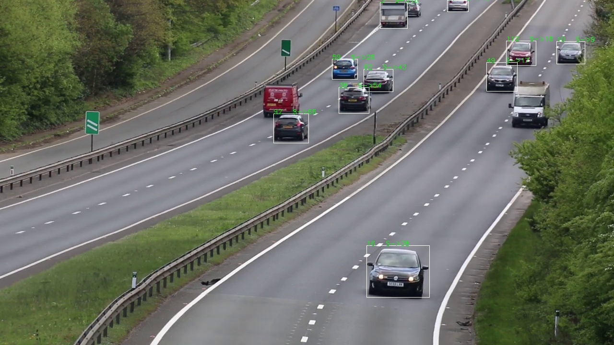
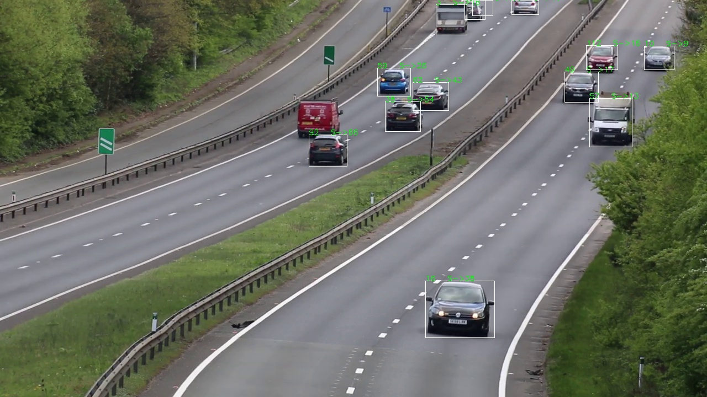

# README #

## Project Name: Vehicle Detection and tracking 

The aim is to detect vehicles and track them with individual IDs and estimate the speed.

following pretrained models has been used 
1. Yolov3  - detection
2. DeepSORT - tracking

For speed estimate time stamp based pixel covered is calculated. As a sample mapping 
is considered (one meter in every 3 pixel) speed of the vehicles is calculated. 

To get actual speed one time calibration in terms of pixel to physical distance mapping can be done. 

#Note
As we move from the bottom to top in image, pixel to distance relation changes exponentially. Equation need to be derived to get approximate speed. 

#Some results:

## format ID  S-> speed 

